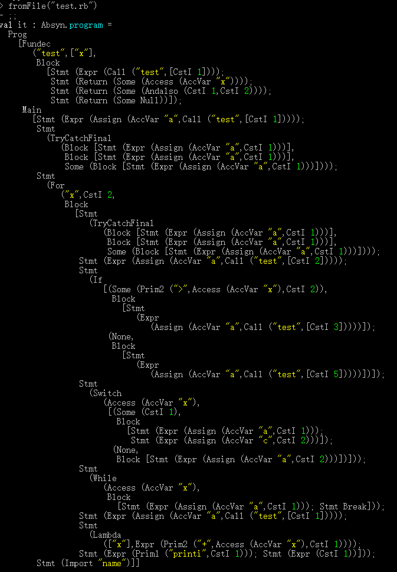
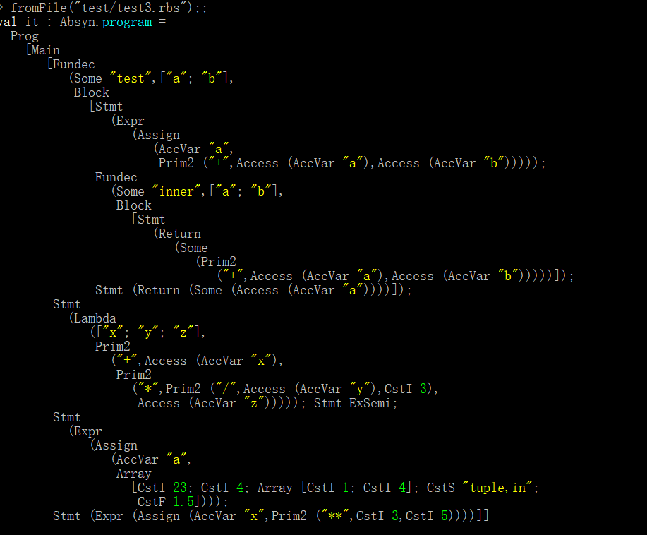
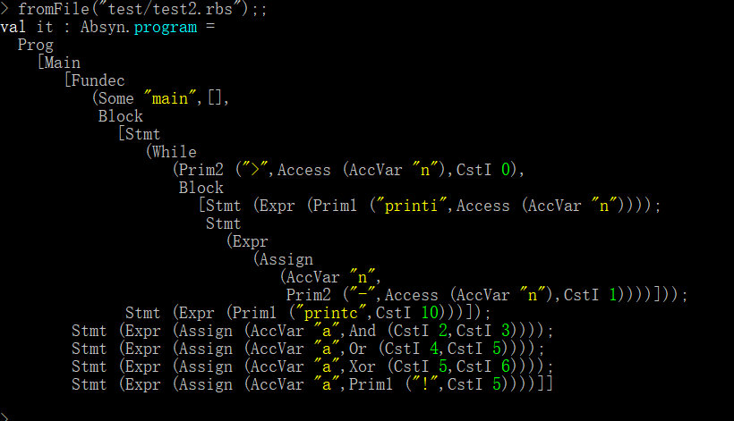

## CODE SHOW
Normal Grammer 
```
$tests
$.
123
.$
def x(a){
	a = 1;
	def y(b){
		c = 1;
	}
}
def test(x){
	test(1);;;
	return x;
	return 1 and 2;
	return null;
}
a = test(1);
try{
	a=1;
}catch{
	a=1;
}finally{
	a=1;
}
for(x in range(2))
{
	try{
		a=1;
	}catch{
		a=1;
	}finally{
		a=1;
	}
	a = test(2);
	if(x>(test(2)+33)){
		a = test(3);
	}else{
		a = test(5);
	}
	switch(x){
		case(1):{
			a=1;
			c=2;}
		default:{
			a=2;
		}	
	}
	while(x){
		a=1;
		break;
	}
	a = test(1);
	print(1);
	true;
	if(x>test(0)){
		b=2;
	}
}
import name;
```
## The Code's AST 




## Code Show
Inner define function and some special grammer style

```
def test(a,b){
	a = a+b;
	def inner(a,b){
		return a+b;
	}
	return a;
}

lambda x,y,z:x+y/3*z;
a = [23,4,[1,4],("tuple,in"),1.5];
x = 3**5;

```


## Code Show
About while iteration and some bitwise operation, like and, or, xor, not

```
def main(){
  while (n > 0) {
    print n;
    n = n - 1;
  }
  println;
}
a = 2 and 3;
a = 4 or 5;
a = 5 xor 6;
a = not 5;

```



